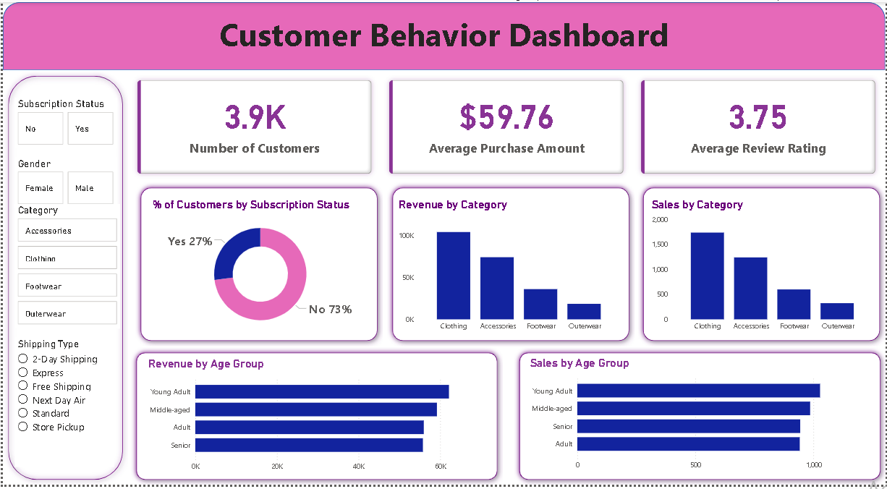

# customer_behaviour_analysis
Customer Behaviour Analysis Dashboard built using Python, SQL, and Power BI. This project transforms raw customer data into actionable business insights through interactive visualizations, KPI analysis, and trend tracking to support smarter, data-driven decision-making.

## Dashboard Preview

Overview

This project focuses on analyzing customer behaviour and business performance using Python, SQL, and Power BI. The goal of the project is to transform raw customer data into meaningful insights that help businesses make data-driven decisions. The workflow includes data cleaning, exploratory data analysis (EDA), SQL querying, dashboard development, and business reporting.

The project demonstrates practical data analytics skills including data preprocessing, database querying, visualization, KPI tracking, and insight generation.

Dataset

The dataset contains customer-related information such as:

Customer demographics
Purchase history
Subscription details
Product categories
Sales performance
Customer ratings and reviews
Tools & Technologies
Python – Data cleaning, preprocessing, and EDA
Pandas & Matplotlib – Data analysis and visualization
SQL (PostgreSQL/MySQL/SQL Server) – Data querying and analysis
Power BI – Interactive dashboard creation
Gamma – Presentation (PPT) design and reporting
Project Workflow
1. Data Loading
Imported dataset using Python
Checked data structure and missing values
2. Data Cleaning
Removed duplicates
Handled null values
Standardized data formats
3. Exploratory Data Analysis (EDA)
Analyzed customer purchasing patterns
Identified sales trends and KPIs
Created visualizations for insights
4. SQL Analysis
Wrote SQL queries for business insights
Performed aggregations, filtering, joins, and KPI calculations
5. Power BI Dashboard

Created an interactive dashboard featuring:

Customer demographics analysis
Sales & revenue tracking
Subscription insights
Product category performance
KPI visualization
6. Reporting & Presentation
Generated business report
Created project presentation using Gamma
Dashboard Features
Interactive filters and slicers
KPI cards
Trend analysis charts
Customer segmentation visuals
Business performance tracking
Results & Insights

The analysis helped identify:

Top-performing product categories
Customer purchasing behaviour trends
Revenue growth opportunities
Key business performance indicators
How to Run
Clone this repository
Install required Python libraries
Load the dataset
Run the Python analysis scripts
Execute SQL queries in your database system
Open the Power BI dashboard file to explore insights
Conclusion

This project highlights end-to-end data analytics skills, from raw data processing to business intelligence reporting. It demonstrates the ability to convert complex datasets into actionable insights through professional dashboards and reports.
